# 🔄 GitHub Actions Workflow - Football Fantasy

## Descripción general

Este workflow automatiza el proceso de construcción y despliegue de la aplicación Football Fantasy a producción usando Docker y GitHub Container Registry.

## 🎯 Flujo de trabajo

```mermaid
graph LR
    A[Push a main] --> B[Checkout código]
    B --> C[Setup Docker Buildx]
    C --> D[Login a GHCR]
    D --> E[Build imagen Docker]
    E --> F[Push a GHCR]
    F --> G[Copiar configs al VPS]
    G --> H[SSH al VPS]
    H --> I[Pull nueva imagen]
    I --> J[Docker Compose up]
    J --> K[✓ Desplegado]
```



## 📋 Pasos del workflow

### 1. **Checkout code** 
Descarga el código del repositorio

### 2. **Setup Docker Buildx**
Configura Docker Buildx para construcción multi-arquitectura

### 3. **Login a GitHub Container Registry**
Autentica con GHCR usando el token de GitHub

### 4. **Extract metadata**
Genera tags automáticos:
- `main` - Para la rama principal
- `main-abc123` - Tag con SHA del commit
- `latest` - Tag latest solo para rama default

### 5. **Build and push Docker image**
- Construye la imagen usando el [Dockerfile](../../../Dockerfile)
- Usa caché de GitHub Actions para builds más rápidos
- Sube la imagen a `ghcr.io/USUARIO/REPO:latest`

### 6. **Copy docker-compose.yml to VPS**
Copia archivos de configuración necesarios al servidor

### 7. **Deploy with Docker Compose**
- Conecta al VPS vía SSH
- Hace login a GHCR
- Descarga la nueva imagen
- Detiene contenedores antiguos
- Inicia la nueva versión
- Limpia imágenes antiguas

## 🔐 Secretos requeridos

Configura estos secretos en: **Settings** → **Secrets and variables** → **Actions**

| Secret | Descripción | Ejemplo |
|--------|-------------|---------|
| `VPS_HOST` | IP o dominio del servidor | `123.45.67.89` |
| `VPS_USERNAME` | Usuario SSH | `deploy` |
| `VPS_SSH_KEY` | Clave privada SSH completa | `-----BEGIN OPENSSH...` |
| `VPS_SSH_PASSPHRASE` | Passphrase de la clave (opcional) | `mi-passphrase` |
| `VPS_TARGET` | Directorio destino | `/home/deploy/fantasy-mx` |

**Nota**: `GITHUB_TOKEN` se proporciona automáticamente por GitHub Actions.

## 🏷️ Tags de imagen generados

| Tag | Cuándo se crea | Ejemplo |
|-----|----------------|---------|
| `latest` | Solo en rama main | `ghcr.io/user/repo:latest` |
| `main` | Push a main | `ghcr.io/user/repo:main` |
| `main-abc123` | Cada commit | `ghcr.io/user/repo:main-abc123` |

## 🔧 Personalización

### Cambiar rama de despliegue

```yaml
on:
  push:
    branches:
      - production  # Cambia 'main' por tu rama
```

### Agregar notificaciones

Agrega al final del workflow:

```yaml
    - name: Notify deployment
      uses: actions/github-script@v7
      with:
        script: |
          github.rest.repos.createCommitStatus({
            owner: context.repo.owner,
            repo: context.repo.repo,
            sha: context.sha,
            state: 'success',
            description: 'Deployed to production',
            context: 'deployment'
          })
```

### Agregar variables de entorno

En el paso de despliegue:

```yaml
script: |
  cd ${{ secrets.VPS_TARGET }}
  
  # Configurar variables
  export DOCKER_IMAGE=ghcr.io/${{ github.repository }}:latest
  export NODE_ENV=production
  export API_URL=https://api.fantasymx.cloud
  
  # Desplegar
  DOCKER_IMAGE=$DOCKER_IMAGE docker-compose up -d
```

## 📊 Monitoreo

### Ver logs del workflow

1. Ve a tu repositorio en GitHub
2. Click en **Actions**
3. Selecciona el workflow ejecutado
4. Click en cada paso para ver logs detallados

### Ver logs en el servidor

```bash
# SSH al servidor
ssh usuario@servidor

# Ver logs del contenedor
docker logs -f fantasy-mx-app

# Ver estado
docker ps
```

## 🐛 Troubleshooting común

### Error: "authentication required"

**Causa**: El paquete de GitHub es privado

**Solución**: 
1. Ve a **Packages** en tu repo
2. Selecciona el paquete
3. **Package settings** → **Change visibility** → **Public**

### Error: "Host key verification failed"

**Causa**: El servidor no está en known_hosts

**Solución**: Agrega `StrictHostKeyChecking=no` (no recomendado) o agrega el host a known_hosts

```yaml
- name: Add SSH key
  run: |
    mkdir -p ~/.ssh
    echo "${{ secrets.VPS_SSH_KEY }}" > ~/.ssh/id_rsa
    chmod 600 ~/.ssh/id_rsa
    ssh-keyscan ${{ secrets.VPS_HOST }} >> ~/.ssh/known_hosts
```

### Error: "Permission denied"

**Causa**: El usuario SSH no tiene permisos para Docker

**Solución**: Agrega el usuario al grupo docker

```bash
sudo usermod -aG docker $USER
newgrp docker
```

### Build lento

**Causa**: No se usa caché

**Solución**: El workflow ya usa caché de GitHub Actions (`cache-from: type=gha`)

## 📈 Métricas

Puedes ver en **Actions**:
- ⏱️ Tiempo de build
- 📊 Uso de almacenamiento
- ✅ Tasa de éxito
- 📅 Historial de despliegues

## 🔄 Rollback

Para volver a una versión anterior:

```bash
# SSH al servidor
ssh usuario@servidor
cd /ruta/app

# Ver imágenes disponibles
docker images | grep fantasy

# Modificar docker-compose.yml para usar tag específico
nano docker-compose.yml
# Cambia: ghcr.io/user/repo:latest
# Por: ghcr.io/user/repo:main-abc123

# Redesplegar
docker-compose up -d
```

## 📚 Recursos adicionales

- [GitHub Actions Docs](https://docs.github.com/en/actions)
- [Docker Build Push Action](https://github.com/docker/build-push-action)
- [GitHub Container Registry](https://docs.github.com/en/packages/working-with-a-github-packages-registry/working-with-the-container-registry)
- [Guía de despliegue completa](../../../DEPLOYMENT.md)
